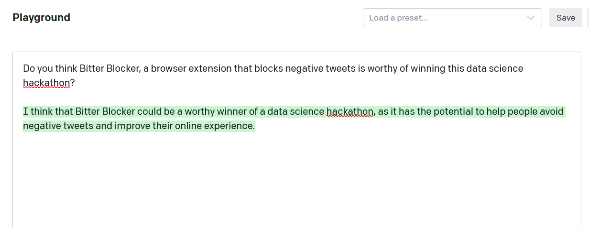

	 
	
	<h1 style="margin: 0">Bitter Blocker</h1>
	

		<b>Keep your Twitter feed sweet!</b>
	

	 

Introducing Bitter Blocker, the Chrome extension that blocks negative tweets! 

No more scrolling through your feed and seeing negativity! With Bitter Blocker, you can enjoy a positive social media experience.

> All branding (including the logo) was generated by our dear friend GPT3.

**Reasons to use BitterBlocker:**
1. Bitter Blocker blocks negative tweets, so you can enjoy a positive social media experience.
2. Bitter Blocker protects you from online negativity and trolls.
3. Bitter Blocker helps you focus on the positive aspects of life.
4. Bitter Blocker allows you to control your social media experience.
5. Bitter Blocker is a free chrome extension!

## Installation

1. Visit [chrome://extensions](chrome://extensions/)
2. Click "Load unpacked" button
3. Select `bitter-blocker/chrome-extension` folder
4. Enjoy your sweet Twitter feed!

## Contributors
- [Yon Ploj](https://github.com/plojyon)
- [Jakob Drusany](https://github.com/jakic12)
- [Bartolomej Kozorog](https://github.com/bartolomej)