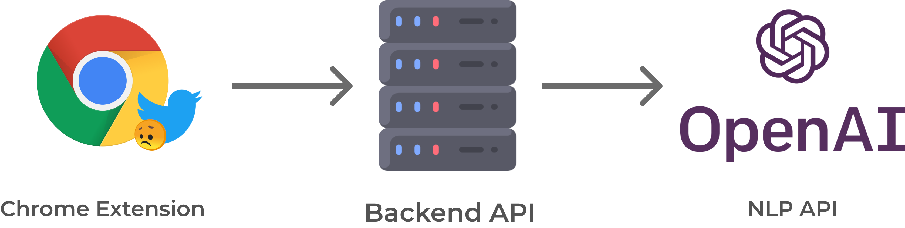

	 
	
	<h1 style="margin: 0">Bitter Blocker</h1>
	

		<b>Keep your Twitter feed sweet!</b>
	

	 

Introducing Bitter Blocker, the Chrome extension that blocks negative tweets! 

No more scrolling through your feed and seeing negativity! With Bitter Blocker, you can enjoy a positive social media experience.

> All branding (including the logo) was generated by our dear friend GPT3.

**Reasons to use BitterBlocker:**
1. Blocks negative tweets, so you can enjoy a positive social media experience.
2. Protects you from online negativity and trolls.
3. Helps you focus on the positive aspects of life.
4. Allows you to control your social media experience.
5. Is a free Chrome extension!

## Installation

1. Visit [chrome://extensions](chrome://extensions/)
2. Click "Load unpacked" button
3. Select `bitter-blocker/chrome-extension` folder
4. Enjoy your sweet Twitter feed!

## System Overview

We've developed a browser extension that can interact with the user's social media websites.

For starters, we only support Twitter, but we could easily extend our solution to other platforms like Facebook, etc.

Our browser extensions communicates with our backend server, which in turn interacts with a NLP (Natural Language Processing) tool of choice (we currently support [nltk](https://www.nltk.org/) and [OpenAI GPT3](https://openai.com/blog/openai-api/)).

## Contributors
- [Yon Ploj](https://github.com/plojyon)
- [Jakob Drusany](https://github.com/jakic12)
- [Bartolomej Kozorog](https://github.com/bartolomej)